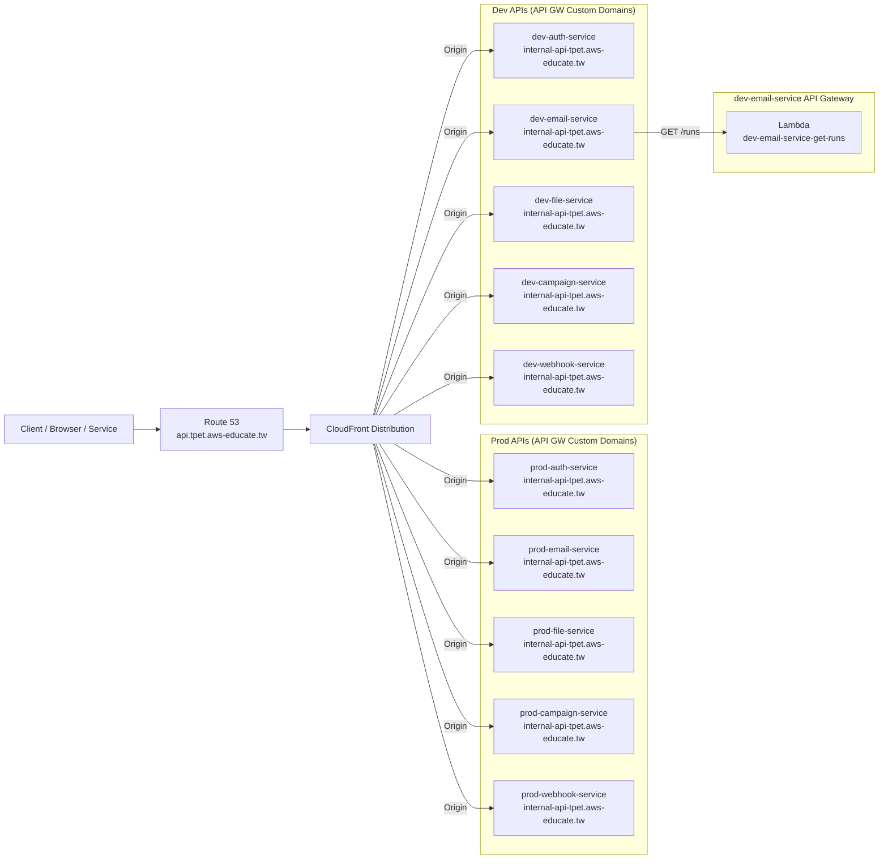

## Table of Contents

---
## 1. 背景知識

在八屆 [dev team training 1 課程](https://youtu.be/oTzyq0q3KV0?si=cRQ6hEZFdNS2Hk7A)裡面，我們知道在 TPET 中一個 API 請求的執行路徑是：

> Cloudfront → API Gateway → Lambda

但在前端的工程師要怎麼讓一個 UI 元件可以發送請求執行這一連串路徑呢?


### 1-1. 前端是怎麼打 API 的?

實際去看前端程式碼，大家會發現前端並沒有「指定要打哪一個 API Gateway」，而是統一呼叫一個 **Base URL**，再搭配不同的 **Path Pattern** 來區分功能。例如以下這段程式碼對 `${base_url}/runs` 發送 HTTP GET 請求，其實背後做的事情是呼叫 email-service 的 `/runs` API。

[bookmark](https://github.com/aws-educate-tw/email-sender-nextjs/blob/f484fbfb94b13cb0d0583fefb353f8fcd0172191/src/app/emailHistory/page.tsx#L95)

### 1-2. Base_url + path pattern 背後做的事?

以前端專案的 netlify bot 所建立的 preview 畫面而言，背後呼叫的其實是 [`https://api.tpet.aws-educate.tw/dev`](https://api.tpet.aws-educate.tw/dev) 這個 URL，再依據**環境**、**服務類型**和**功能**加上 **Path Pattern**，例如：`/dev/email-service/runs`

> 白話比喻呼叫 Base_url + path pattern，其實就像打電話到同一個總機（Base URL），再說一個分機號碼（path pattern）就可以找到對應專員。
> 

這時候大家可能有個疑惑是，既然我們發送 API 的請求流程是 Cloudfront → API Gateway → Lambda，那為什麼不是直接打 cloudfront distribution 的 domain ([https://dxxxxxxxx.cloudfront.net](https://dxxxxxxxx.cloudfront.net/)) 呢? 當我們使用自有網域來當呼叫的 URL，背後又是如何導向到 cloudfront 呢?

---

## 2. 透過 Self domain 打請求到 Lambda 的過程發生了什麼事?

以在 netlify bot 建立的預覽畫面執行 GET `/runs` 為例子，背後其實會呼叫 `GET /dev/runs` ，而這個舉動實際上是發送請求到完整 URL [`https://api.tpet.aws-educate.tw/dev/runs`](https://api.tpet.aws-educate.tw/dev/runs)。整個請求一路上會經過以下幾個階段：

### 2-1. DNS 解析（Route 53）

當瀏覽器看到 `api.tpet.aws-educate.tw` 時：

1. 會透過 Route 53 進行 DNS lookup
2. Route 53 回傳一個 CloudFront distribution domain ([dxxxxx.cloudfront.net](http://dxxxxx.cloudfront.net/))，這樣請求就可以進入到 Cloudfront

<aside>
如果是配置 CNAME ，才會中間會解析出 CloudFront Distribution Endpoint 再解析出 IP，但我們是用 Alias (A Record) 會直接解析到 CloudFront 的 Anycast IP

```
dig api.tpet.aws-educate.tw

; <<>> DiG 9.10.6 <<>> api.tpet.aws-educate.tw
;; global options: +cmd
;; Got answer:
;; ->>HEADER<<- opcode: QUERY, status: NOERROR, id: 11086
;; flags: qr rd ra; QUERY: 1, ANSWER: 4, AUTHORITY: 4, ADDITIONAL: 1

;; OPT PSEUDOSECTION:
; EDNS: version: 0, flags:; udp: 4096
;; QUESTION SECTION:
;api.tpet.aws-educate.tw.	IN	A

;; ANSWER SECTION:
api.tpet.aws-educate.tw. 60	IN	A	3.169.121.127
api.tpet.aws-educate.tw. 60	IN	A	3.169.121.80
api.tpet.aws-educate.tw. 60	IN	A	3.169.121.109
api.tpet.aws-educate.tw. 60	IN	A	3.169.121.65

;; AUTHORITY SECTION:
aws-educate.tw.		300	IN	NS	ns-1103.awsdns-09.org.
aws-educate.tw.		300	IN	NS	ns-1728.awsdns-24.co.uk.
aws-educate.tw.		300	IN	NS	ns-4.awsdns-00.com.
aws-educate.tw.		300	IN	NS	ns-668.awsdns-19.net.

;; Query time: 211 msec
;; SERVER: 2407:4b00:1c02:77d9:4f2:67ff:fe6e:e6a8#53(2407:4b00:1c02:77d9:4f2:67ff:fe6e:e6a8)
;; WHEN: Sun Dec 28 04:47:21 CST 2025
;; MSG SIZE  rcvd: 254

```
</aside>

### 2-2. CloudFront：統一入口 + Path-based routing

CloudFront 根據 **Request Path** 與 **Behavior 設定的 Path Pattern** 決定轉發到哪一個 **Origin。**

1. Cloudfront Origin
    - 在 TPET 中， Origin 即 API Gateway 的 Custom Domain，這實現了讓請求透過 Cloudfront 傳遞到不同 API Gateway 的串接 。
        
        
        
2. Cloudfront Behavior 
    - 至於如何判斷什麼情況要傳到哪個 API gateway，就是在 behavior 這邊去做定義，比方說
        - 當請求後面的 pattern 是 `/dev/email-service/*`  → 就打給 `dev-email-service.internal-api-tpet.aws-educate.tw` (dev 環境裡面的 email-service api gateway)
        - 當請求後面的 pattern 是 `/prod/auth/*`  → 就打給 `prod-auth-service.internal-api-tpet.aws-educate.tw` (prod 環境裡面的 email-service api gateway)
        
        
        

### 2-3. 小結架構圖

總結剛剛的這串流程，可以把 Self domain 打請求到 Lambda 的過程總結成以下的圖



---

## 3. 如果我今天要建立一個新的 API gateway，要怎麼讓請求透過 domain 打進來?

### 3-1. 設定 API Custom Domain & 創建 A Record

1. **建立 Custom Domain Name**
    - 在 API Gateway 設定專屬網域（例：`dev-onboarding-internal-api-tpet.aws-educate.tw`）。
        
        
        
2. **設定 API Mappings** 
    - 要讓剛剛建立的 Custom Domain Name 知道要對應的是哪個 API gateway
        
        
        
    - Stage: `dev`
    - Path:  `dev`
    - 關鍵邏輯：Mapping Path 會「抵銷」網址中的第一層路徑。若網址為 `/dev/onboarding/test`，Path 設為 `dev`，API 內部資源只需處理 `/onboarding/test`。
        
        
        
3. **Route 53 設定**
    - 在替 Custom Domain Name 設定 Route53 A record  之前，沒有人知道 Custom Domain Name 到底要如何解析，所以接下來的步驟就是要讓大家知道這個 Custom Domain Name 是誰?
    - 進入 route53 選 domain `aws-educate.tw`，替 Custom Domain Name 建立 A 記錄，開啟 Alias (別名)
    - 選擇指向 API Gateway 的 endpoint
        
        


<aside>
小驗收時間!!

假設你完成了 3-1 步驟，想確認有沒有成功的話可以執行以下指令，理論上要回傳預期的內容喔! 如果沒有的話，你也可以試著研究看看回傳的 DNS 解析過程，判斷請求有成功丟到哪?沒有成功丟到哪? 這樣會讓你更有方向是哪裡出錯!

```bash
# 以 dev 環境的 onboarding-test 為例
curl -v https://dev-onboarding-test-internal-api-tpet.aws-educate.tw/dev/onboarding/test
```

</aside>

### 3-2. Cloudfront 連接

1. Origin (來源) 設定
    - Origin Domain: 填入 Step 1 建立的 API Gateway 自定義網域。
    - Origin Path: 保持空白。
        - *避坑指南*：若在此填寫 `/dev`，CloudFront 轉發時會多加一層路徑，導致 API Gateway 報 404。
        
        
        
2. Behavior (行為) 設定
    - Path Pattern: 設定觸發路徑（例：`/dev/onboarding/*`，這只是為了和 dev 環境的 api gateway 做區分）。
    - Origin Request Policy: 必須選 `Managed-AllViewerExceptHostHeader`。
        - 重要原因：API Gateway 是靠 `Host` 標頭識別 Mapping 規則。CloudFront 必須將 Host 換成 API Gateway 的網域（`dev-onboarding-...`）而非原始網域（`api.tpet...`）。
    - Cache Policy: 選 `Managed-CachingDisabled` 確保 API 回應即時。
        
        
        
3. 調整順序 (Precedence)
    - **原則**：越具體（細分）的路徑優先級越高。
    - **動作**：將新的 `/dev/onboarding/*` 移動到最廣域的 `/dev/*` 規則之上。

<aside>
小驗收時間!!

假設你完成了 3-2 步驟，想確認有沒有成功的話可以執行以下指令，理論上要回傳預期的內容喔! 如果沒有的話，你也可以試著研究看看回傳的 DNS 解析過程，判斷請求有成功丟到哪?沒有成功丟到哪? 這樣會讓你更有方向是哪裡出錯!

```bash
# 以 dev 環境的 onboarding-test 為例
curl -v https://api.tpet.aws-educate.tw/dev/onboarding/test
```

</aside>