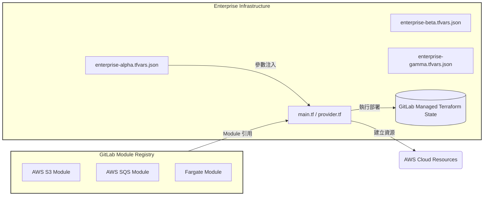
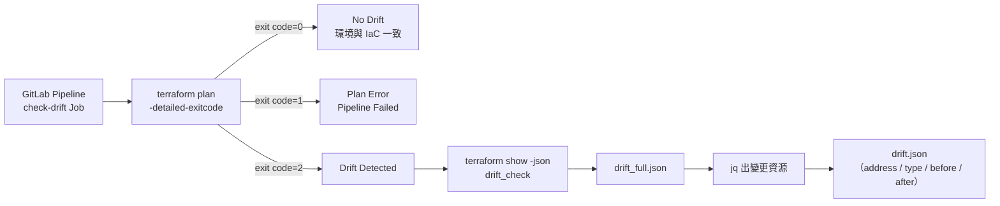
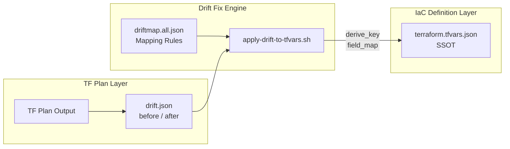
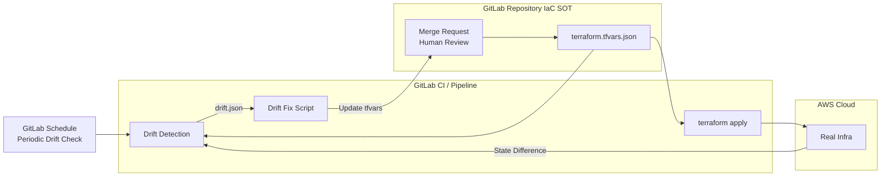

在基礎建設自動化的世界裡，**Terraform** 扮演著「基礎設施即程式碼（IaC）」的角色，而 **GitLab** 則像是它的管家，幫忙保存狀態、管理版本，甚至透過 pipeline 自動執行。這兩者的結合，讓團隊能夠在混亂的雲端環境裡維持秩序。

但現實世界總不乏例外。當基礎設施的「真實狀態」和 Terraform 腦袋裡的 `.tfstate` 不一致時，就會產生所謂的 **Terraform Drift**。這種情況有點像是你明明把房間收好，但有人半夜偷偷把原本在桌上的書拿去放在書架上，害你早上醒來找不到書(因為你還以為書還在桌子上)。

會撰寫這篇筆記，是因為在實務環境中，常常會遇到必須「直接進 AWS Console 緊急調整資源」的情境，這類操作雖然解決了當下問題，卻也容易造成 Terraform 與 GitLab Pipeline 中的 IaC 描述產生落差（Drift）。因此，這篇文章除了說明 Terraform Drift 的概念，也記錄了我在實務中設計的一套 Drift 偵測與修復機制。


---

## 什麼是 Terraform Drift?

Terraform 的狀態檔（`terraform.tfstate`）可以想像成一張**地圖**，記錄了：
- 有哪些資源
- 每個資源的屬性值
- Terraform 認為「現在世界長怎樣」

**Drift** 就是代表這張地圖和真實世界對不上時出現的落差。

常見原因包括：

* **手動修改**：有人直接在 AWS Console 點了幾下，結果 Terraform 並不知道。
* **外部系統干預**：像監控服務或 CI/CD 流程自動幫你改了一些配置。
* **雲端預設行為**：例如安全群組自動增加規則、自動擴展調整參數。

結果就是：Terraform 以為的狀態和實際狀態對不上。

---

## 為什麼 Drift 是一個「組織級問題」？

Drift 的可怕之處不在於「資源被改了」，而在於：

- Terraform **不知道自己不知道**
- 下一次 `terraform apply`，你可能會：
  - 不小心覆蓋掉重要的手動修正
  - 或在不知情的情況下大規模重建資源

如果沒有一套制度，IaC 最後會退化成「只在第一次有用」。

---


## 處理 Terraform Drift 的基本策略

處理 Drift 本質上只有三條路：

1. **忽略它（不推薦）**
2. **以 Terraform 為準，強制 apply 回去**
3. **承認遠端狀態是事實，回寫進 IaC**

---

## 實戰設計：用 GitLab Pipeline 管理 Drift

在設計這套 Drift 處理機制時，我希望滿足以下幾個原則：

- Drift 必須被「看見」，而不是被掩蓋
- 真實世界的變動可以被吸收，但不能偷偷發生
- IaC 仍然是唯一可以被信任的來源
- 所有修復都必須可回溯、可審查

因此在這個解決解決方案中，不僅要「發現」Drift，更要能「自動化」去處理它。以下是我在 GitLab CI/CD 中的實作架構。

### 為何使用 Gitlab
除了方便集中管理腳本與設定檔外，更重要的是 GitLab 本身就提供了完整的 Terraform Backend、State Lock 與 CI/CD 整合能力，使得 IaC 的治理可以在單一平台完成，而不需要額外引入第三方工具。


* **Terraform Backend**
  GitLab 可以作為 Terraform 的 backend，安全地存放和版本控制 `.tfstate` 檔。透過 API，存取會自動加密，避免狀態檔洩漏或版本衝突。
* **Pipeline 整合**
  GitLab CI/CD pipeline 可以直接執行 `terraform plan`、`apply` 等命令，實現「程式碼提交 → Pipeline 驗證 → 自動佈署」。
* **Module 儲存**
  GitLab Repo 也能充當 Terraform module registry。公司內部常用的模組可以統一放在 GitLab，跨專案引用。

例如，我可以在其他專案引用某個專案定義的 terraform module `ses-product`：

```hcl
module "xm-stg-ses" {
  source  = "<gitlab-host-domain>/<ses-product-module-path>"
  version = "0.0.0"

  product_name = "xm"
  domain_name  = "xm-stg.svy.do"
  project_name = "surveycake-xm-stg"

  aws_region  = "us-west-2"
  mail_sender = "xm_stg@25demo.com"
  tags        = {"usage":"xm staging"}
  ...
}
```

這樣每個專案只要透過 `module` 呼叫，就能快速套用標準化的基礎設施組件。

### 前置說明：IaC 的動態注入與隔離
在這個架構中，專案 A 本身不重複撰寫資源邏輯，而是透過 module 塊指向 專案 B 的 GitLab 位址。當 Pipeline 啟動時：

- 環境隔離：透過變數 _ENTERPRISE 決定讀取哪一份 `.tfvars.json` 並指向獨立的 `_STATE_NAME`（例如 `enterprise-xxx-tf_state`）。
- 動態配置：Terraform 讀取 `terraform.tfvars.json` 裡的客製化參數（如 product_name, domain_name），將其傳遞給專案 B 的通用模組。
- 唯一來源：對於單一企業環境而言，對應的 `terraform.tfvars.json` 即成為該環境的 Single Source of Truth(SSOT)。



### 1. Drift 偵測機制 (Drift Detection)

首先，在 gitlab 專案的 pipeline 裡定義了一個 `check-drift` job，利用 Terraform 的 `exitcode` 將「是否發生 Drift」轉換成可被 Pipeline 理解的狀態，再把差異結構化成 JSON，交由後續自動化流程處理。

* **關鍵邏輯**：使用 `terraform plan -detailed-exitcode`。
  * `0`: 無變動。
  * `1`: 執行失敗（Error）。
  * `2`: 有 Drift（真實環境與程式碼不符）。
* **產出物**：將 Plan 結果轉換為 JSON 並提取關鍵資訊（地址、類型、動作、變更前/後的值）。

```yaml
check-drift:
  stage: drift-detection
  script:
    - terraform plan -detailed-exitcode -out="drift_check" -var-file=terraform.tfvars.json
    - status=$?
    - terraform show -json drift_check > drift_full.json
    # 透過 jq 提取關鍵變更內容
    - jq '{ drift: [ .resource_changes[] | select(.change.actions != ["no-op"]) | ... ] }' drift_full.json > drift.json
```



### 2. 自動化回寫與修復流程 (Drift Fix)

當偵測到 Drift 時，我們透過自定義腳本 `apply-drift-to-tfvars.sh` 將雲端的「真實狀態」回寫到專案的 `terraform.tfvars.json` 中。`apply-drift-to-tfvars.sh` 會根據預定義的 `driftmap.all.json`（對照表），將 Terraform 偵測到的 `before` 狀態（即目前雲端的真實值）對應回原始的變數檔案中。

1. **Key 衍生**：透過 `derive_key` 函數，從資源的 Address（例如 `module.s3["my-bucket"]`）解析出變數檔案中對應的 Key。
2. **欄位映射**：根據 `field_map`，將雲端屬性（如 `acl`）對應到 `tfvars` 中的欄位。
3. **精準寫入**：使用 `jq` 的 `argjson` 功能，在不破壞 JSON 結構的前提下更新特定欄位。


---

### 3. GitLab Git-Ops 整合工作流

為了維持「程式碼是唯一真實來源」，我們不直接修改 `main` 分支，而是透過 pipeline 自動開啟 **Merge Request (MR)**。

1. **自動分支與提交**：當 `apply-drift` 被觸發且 `tfvars` 有變動時，Pipeline 會自動建立新分支 `drift-apply-XXXX`。
2. **開啟 MR**：透過 GitLab API 自動建立 Merge Request，並加上描述引導開發者審查。
3. **合併後自動套用**：
   * 當管理員審查並 Merge 該 MR 後，觸發 `main` 分支的 Pipeline。
   * 執行 `terraform apply`，完成最後的同步。

在這個流程中，Merge Request 並不是形式上的檢查點，而是整個 Drift 治理中**唯一且必要的人類介入點**，用來確認「我們是否要承認這次現實世界的變動」。


```yaml
apply-drift-to-tfvars-and-create-mr:
  stage: drift-fix
  script:
    - ./scripts/apply-drift-to-tfvars.sh terraform.tfvars.json drift.json driftmap.all.json
    - git checkout -b "$DRIFT_BRANCH"
    - git commit -m "chore: update terraform.tfvars.json from drift apply"
    - curl --request POST --header "PRIVATE-TOKEN: ${_ACCESS_TOKEN}" "${CI_API_V4_URL}/projects/${CI_PROJECT_ID}/merge_requests" ...

```


## 總結：閉環的 Drift 處理流程

透過這套實作，我們建立了一個**閉環系統**：

1. **Scheduled Check**：定期巡檢。
2. **Auto Update**：自動計算差異並修改設定檔。
3. **Human Audit**：透過 MR 進行人工審查，確保雲端的變動是預期內的。
4. **Auto Apply**：合併後自動對齊，消除落差。

這不僅減少了人工維護 `tfvars` 的負擔，更確保了在多人協作環境下，雲端資源永遠不會脫離 IaC 的管控。



## 結語：治理 Drift，而不是消滅 Drift

Terraform Drift 本身並不是錯誤，而是一種「現實世界介入 IaC 系統」的必然結果，真正的風險，來自於 Drift 發生卻無人察覺，或在下一次 `terraform apply` 時被不小心覆蓋。

這套架構的核心目標，並不是消滅所有手動操作，而是讓每一次偏離都能被偵測、記錄、審查，且最終被吸收回 IaC。透過 GitLab Pipeline、結構化的 Drift 資料、以及以 `terraform.tfvars.json` 為核心的回寫機制，我們讓 Terraform 不再只是「部署工具」，而成為一個能與真實世界共存的治理系統。

